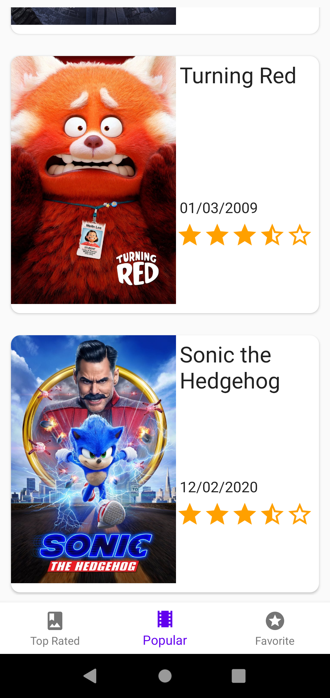

# Movie app
A simple project using [The Movie DB](https://www.themoviedb.org) based on Kotlin MVVM architecture and material designs.<br>



## How to build on your environment
Add your [The Movie DB](https://www.themoviedb.org)'s API key in your `local.properties` file.
```xml
tmdb_api_key=YOUR_API_KEY
```

## Tech stack & Open-source libraries
- 100% [Kotlin](https://kotlinlang.org/) based + [Coroutines](https://github.com/Kotlin/kotlinx.coroutines)
- JetPack
    - ViewModel - UI related data holder, lifecycle aware.
    - Room Persistence - construct database.
- Architecture
    - MVVM Architecture (View - DataBinding - ViewModel - Model)
    - Repository pattern
    - Hilt - dependency injection
- [Retrofit2 & Gson](https://github.com/square/retrofit) - constructing the REST API
- [OkHttp3](https://github.com/square/okhttp) - implementing interceptor, logging and mocking web server
- [Timber](https://github.com/JakeWharton/timber) - logging
- [Stetho](https://github.com/facebook/stetho) - debugging persistence data & network packets


